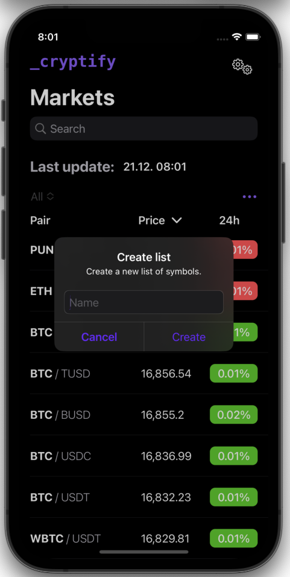
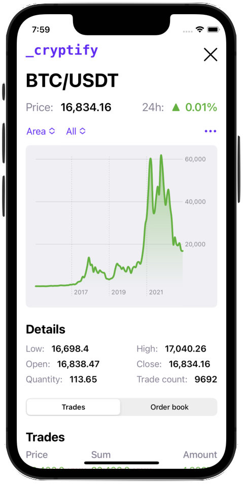
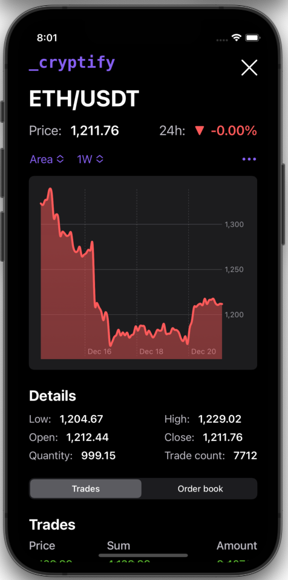
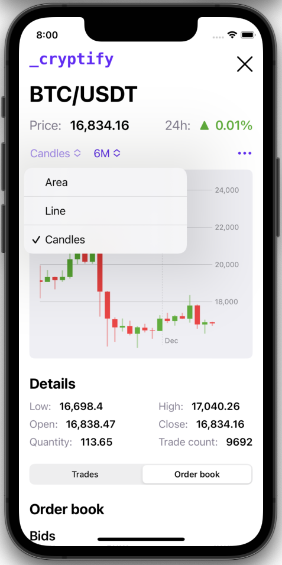
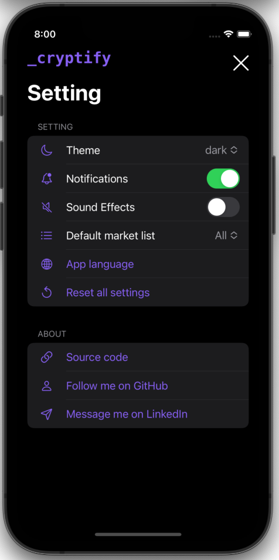
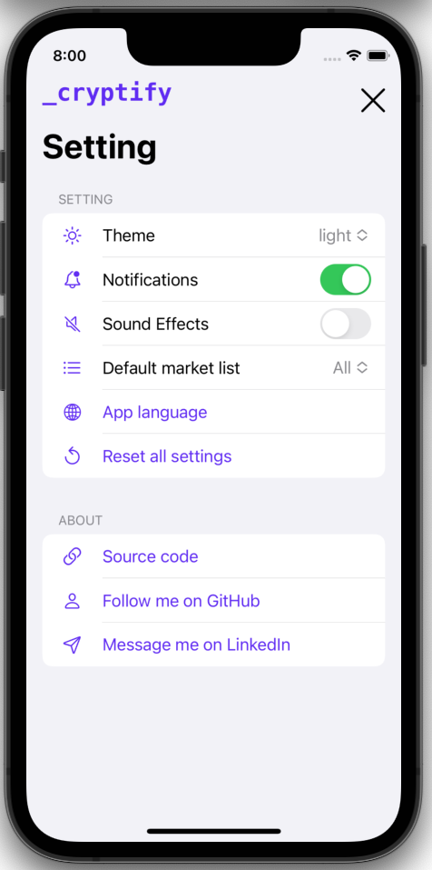
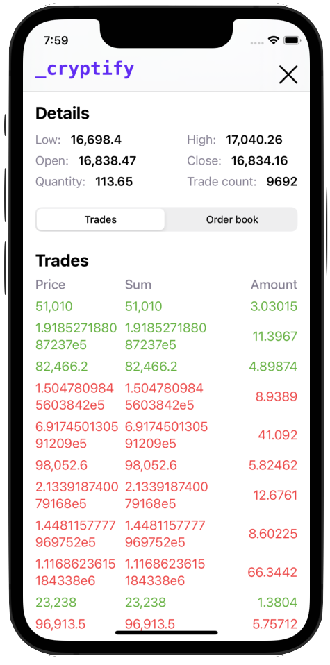

# Cryptify

Cryptify is a native iOS app for tracking the prices of cryptocurrencies.

## Software requirements

- XCode
- iOS 16.0

## Features

- up-to-date crypto prices
- details such as charts, trades, order book
- 3 types of charts
- 12-time intervals (in charts)
- custom persistent watch lists
- light/dark mode
- 2 languages (English, Czech)
- sounds
- notifications
- sorting
- searching

## Screenshots

    
    
    
    
    
    
    
    

