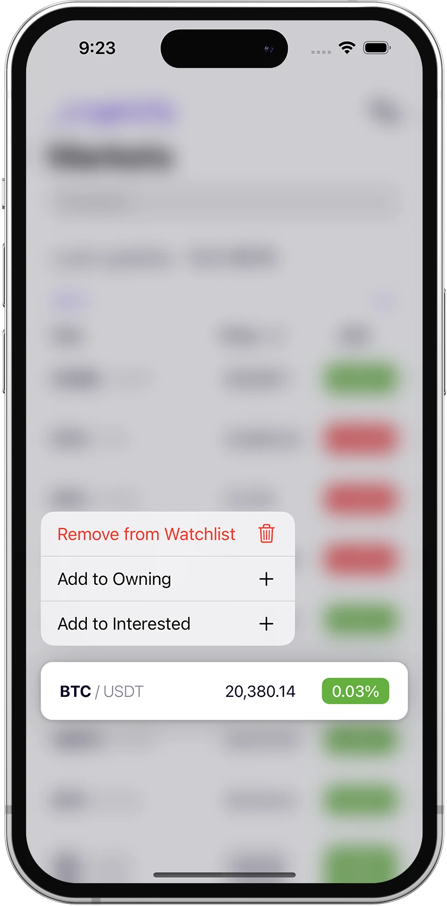
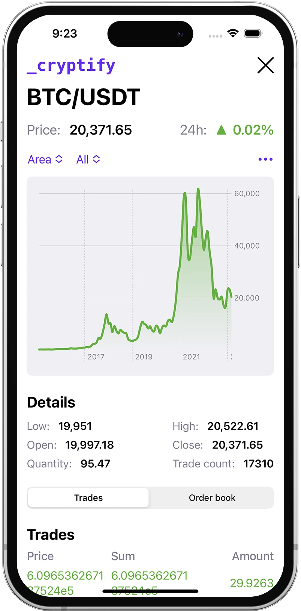
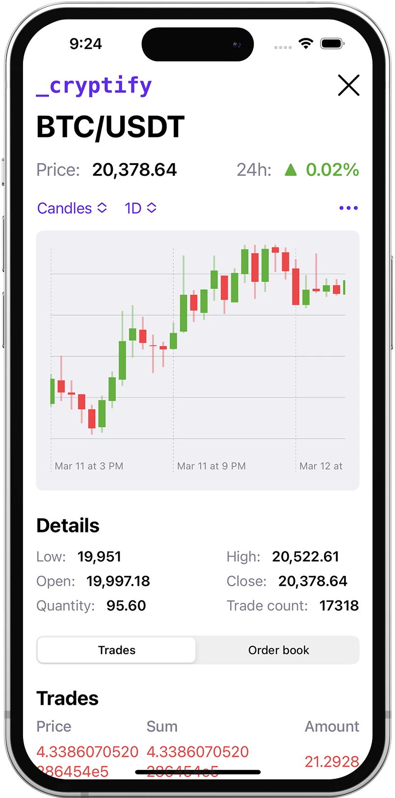
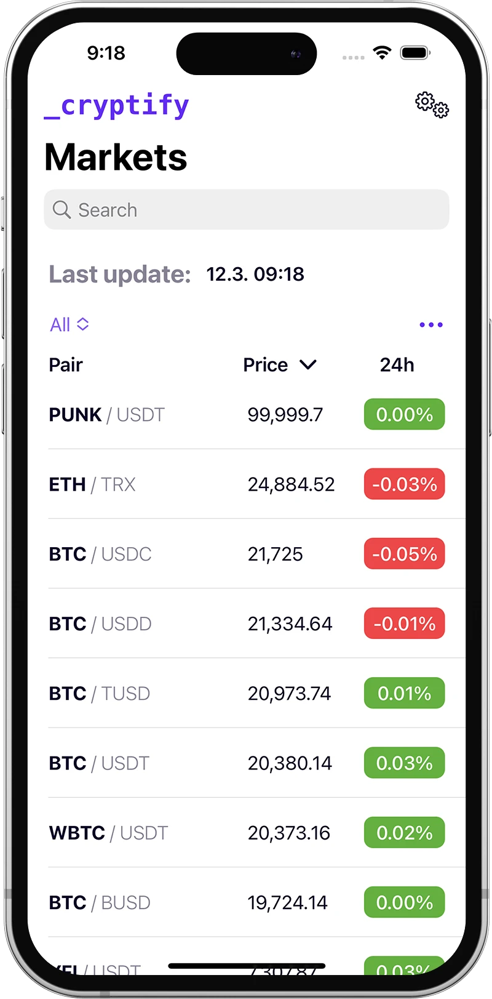
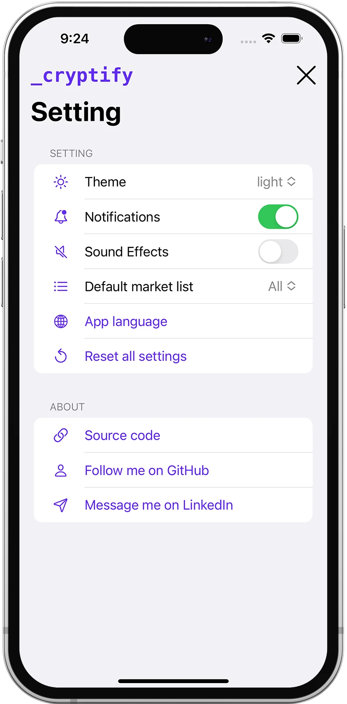
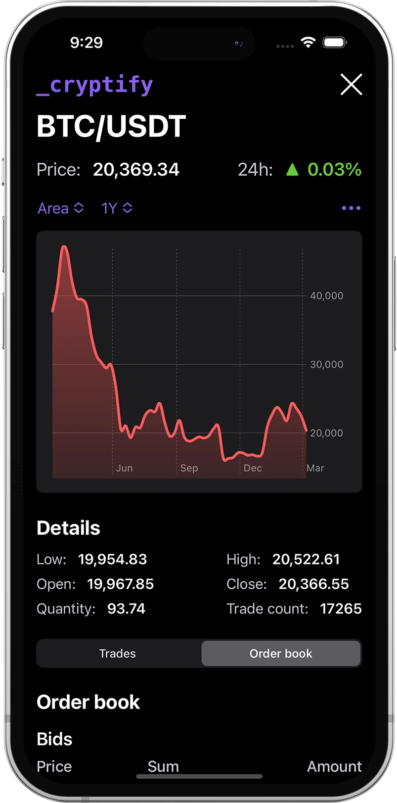
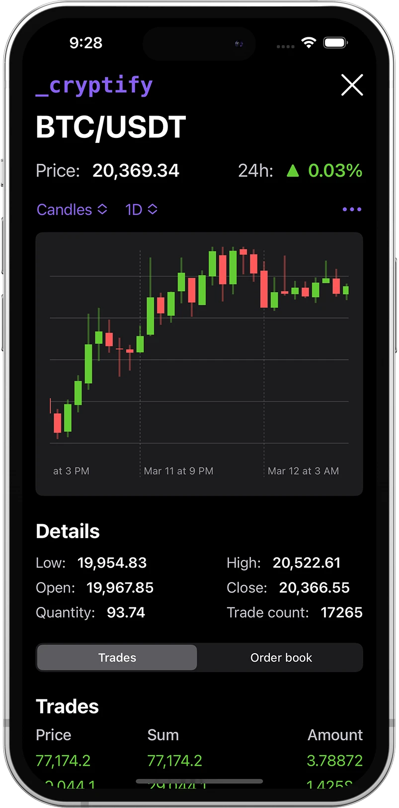
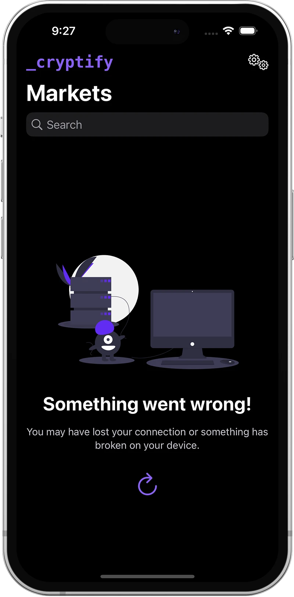
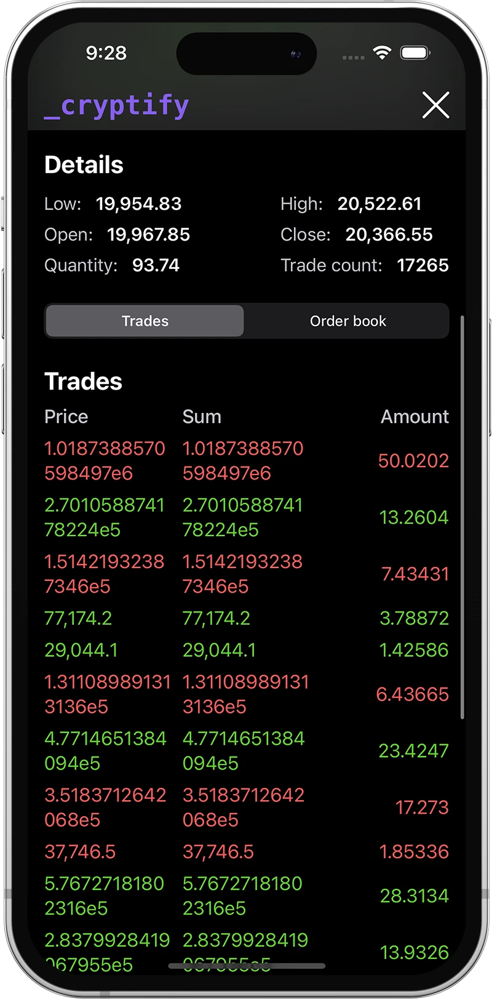
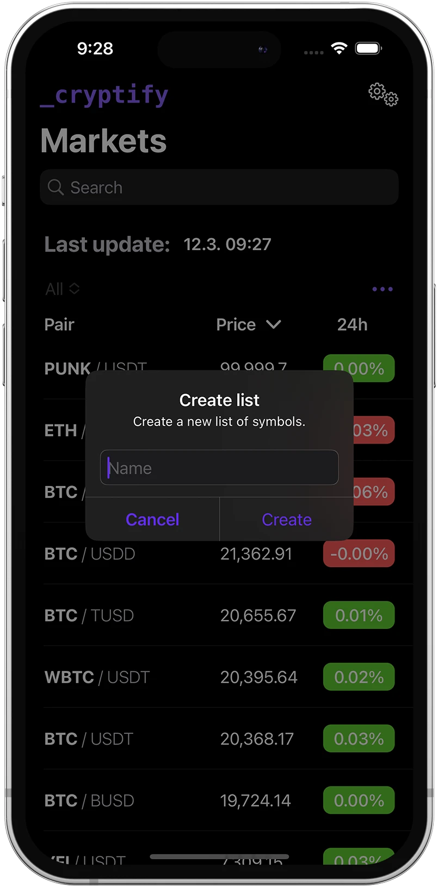

# Cryptify

## 📝 Description

Cryptify is a **mobile app** for **tracking real-time prices of cryptocurrencies**. It is a native app for the iOS operating system, i. e. for the Apple iPhone, created in Swift language and Swift UI framework.

Users can track real-time **rates, charts showing price movements, trades, and order books**. The application offers saving favorite currencies, creating watchlists, sending notifications, or customizing the user interface.

[📺 Video example](https://youtu.be/MLPkQPmpKj0)

    

## ⚽️ Projects goals

The goal was to create a **native mobile app** for the iOS operating system, which allow users to **easily and quickly track the current cryptocurrency rates**. The inspiration was the Apple stock app, which has a similar purpose for stocks. I wanted to create an app that is **simpler and easier to use than complicated crypto exchange apps**.

## 🚀 Features

The most important feature is **displaying the cryptocurrency rates** of different pairs of cryptocurrencies. On the Markets screen, users can see a list of tradable pairs at the [Poloniex](https://poloniex.com/) exchange (I use their [API](https://docs.poloniex.com/#introduction) as a data source). The app allows to **sort** the pairs by price, name or daily change. Furthermore, the users can **search** in the list of pairs.

In addition to the list of all pairs, users have a **watch list** where they can save pairs of interest. It is also possible to **create more lists** and set the default list displayed on the home screen after opening the app.

The second most important feature is displaying **pair detail**. Detail shows current price, daily change, chart, trades, and order book.

The app offers three **chart display options** - area, line, and candle chart. Next, users can choose the **period** that the chart represents. The options are All, 10, 5, 2, 1 year, 6, 3, 1 month, week, day, hour, and 30 minutes.

At the bottom of the pair detail, it is possible to toggle between **trades** and **order book**. Bids and asks are distinguishable by color.

Last but not least, **settings**. The settings screen allows users to change the **theme** (light, dark, system), disable **notifications and sounds**, and change the **app language**. The app supports **English and Czech**.

## ❌ Issues

While developing the app, I experienced several issues. **Luckily I was able to solve all of them**.

Firstly, I couldn't create a **custom toolbar** and override Apple's default NavigationView. I had a problem with the placement of the element in the toolbar, and the toolbar didn't expand when rotating the device.

Another issue was the **cancellation of API requests**. The variable changes triggered a UI refresh that resulted in the cancellation of the pending requests in methods like task or refreshable.

The last issue I'll mention here is **decoding API data**. The order book endpoint sends an array that contains numbers and also strings. As a strictly typed language Swift cannot have both strings and numbers in one array, so I had to create a special structure that takes both values.

## 😁 Conclusion

To conclude everything, I am happy with how the app turned out. I managed to implement all the features I planned and many more that came to my mind during the development process. But there will always be new features, which I can add, for instance, cash the data for times without a cellular connection.

The app is ready, but since I don't have permission to use the Poloniex API commercially, it is not published in the App Store.

## ✅ Software requirements

-   XCode 14
-   iOS 16.0

## 🎆 Screenshots

    
    
    
    
    
    
    
    
    
    

